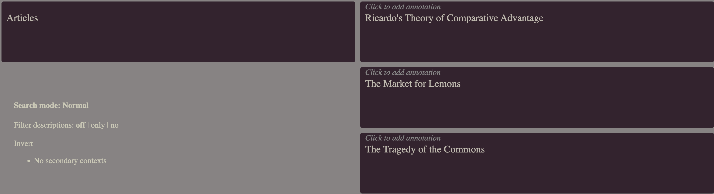

# Rhizome

For the whitepaper, see here: [*Rhizome - A “total recall” note-taking and content-management and -archival system for Superhuman Memory [Whitepaper]*](https://eighttrigrams.net/article/21)

## Getting started - with Docker

Run

```bash
make box
root@dev-box:/workspace/rhizome# make onboard
```

To start the app, use:

## Starting the App

```bash
root@dev-box:/workspace/rhizome# make start
```

When the app is up: press 'c', then type "ar" and hit Enter and you should be in context "Articles", where you should see a couple
of articles listed on the right hand side.



```bash
make stop
make test # if you want to run the tests
make start # to start the server again
```

## Onboard and Cleanup

The command `make onboard` writes a fresh `config.edn`, and a `files` directory in which files imported into Rhizome will be stored. The command `make start` creates a db with demo contexts and articles. These work inside and outside the container. The db and the configs are shared from both sides.

To *remove* configs and db again, use `make clean`. If you want to not seed items, use `:skip-seed?` option.

## Getting started on the host system

Prerequisites are

- JDK21
- Clojure CLI (`clj`)
- Babashka (`bb`)
- node 18+, npm
- sqlite3 CLI
- imagemagick

```bash
npm i
make onboard # If you haven't done already
make test
make start  
make stop
```

## Docker - Claude YOLO

Sandboxed Claude (using Docker). Run

```bash
make yolo
claude@yolo-box:/workspace/rhizome$ make onboard # if haven't done already
claude@yolo-box:/workspace/rhizome$ claude # has playwright MCP, can start app etc.
```

## With Vector DB

**In Docker:** just add `WITH_VEC=1`. An `ollama` sidecar container is
brought up automatically; the embedding model is pulled into a named volume
on first run and cached afterwards. No host-side Ollama install required.

```bash
make box WITH_VEC=1
make yolo WITH_VEC=1
```

**On the host system:** you need Ollama yourself. On MacOS:

```bash
brew install ollama # or your platform's installer
ollama pull qwen3-embedding:0.6b
ollama serve        # listens on http://127.0.0.1:11434
make install-sqlite-vec
```

In both cases, if you haven't yet onboarded, do so

```bash
make onboard
```

or simply add

```clojure
:semsearch {:vec-path #or [#env VEC_PATH "./.sqlite-vec/vec0"]
            :ollama-url #or [#env VEC_URL "http://127.0.0.1:11434"]
            :ollama-model "qwen3-embedding:0.6b"}
```

by hand to `config.edn`. The aero `#or [#env ...]` form lets the same `config.edn` work on host and inside docker: the Dockerfile sets `VEC_PATH=/usr/local/lib/sqlite-vec/vec0` and `VEC_URL=http://127.0.0.1:11437` (a socat bridge `entrypoint.sh` opens onto the `ollama` sidecar); the host falls back to the local install path and `:11434`.

After installing vec, embed the seeded demo articles, while Rhizome is running, run:

```bash
nohup make start & # invoked that way that you can execute next line from the same shell
make backfill-embeddings
```

### Usage

- Visit the Articles context
- Press 'i' (input field on right hand side opens)
- Press 'shift+option+v' (input field should become green)
- Type in a search term

#### Tests

When `:semsearch` is configured in `config.edn` (with a `:vec-path` pointing at a dylib that exists on disk), some additional unit tests run. To skip them, remove the `:semsearch` block from `config.edn` — there is no env-var override anymore.

## End-to-end (Playwright)

E2E tests share the dev port from `config.edn` (3140 by default; override by exporting `PORT=…` in your shell — via direnv, a manual `export`, or inline `PORT=… make e2e`). The lockfile (`.dev-server.lock`) makes dev and e2e mutually exclusive — start one and the other refuses with a diagnostic that includes mode, env, and (for e2e) headed.

```bash
$ npx playwright install chromium                # first time only (on host system only)
$ make e2e                                       # full headless run
$ make e2e HEADED=1                              # show the browser window
$ make e2e T="creates a context"                 # filter by scenario (playwright -g)
$ make e2e NO_BUILD=1                            # skip shadow-cljs release build
                                                 # (reuses cached main.js — fine when
                                                 # no cljs changed since last run)
$ make e2e NO_BUILD=1 T="creates a context"      # iterate fast on one scenario
```

Both work on the host system and in the Docker containers.

## Package, deploy and run

Define these functions

```bash
rhizome-start() {
    if lsof -nP -iTCP:3007 -sTCP:LISTEN >/dev/null 2>&1; then
      echo ":3007 already in use — run rhizome-stop first"
      return 1
    fi
    (cd ~/Applications/rhizome && java -cp server.jar clojure.main -m server &)
    ~/Applications/Tracker-darwin-arm64/Tracker.app/Contents/MacOS/Tracker 2>/dev/null
}
rhizome-stop() {
    local pids=$(lsof -nP -iTCP:3007 -sTCP:LISTEN -t)
    [ -n "$pids" ] && kill $pids || echo "nothing on :3007"
}
```

and then use

```bash
make deploy DEPLOY_TARGET=~/Applications/rhizome
rhizome-start
rhizome-stop
```

`DEPLOY_TARGET` is required and must be passed on the command line — there is
no default and it is deliberately not read from the environment.

Comments
- We use nativefier to serve the app via electron
- A first time run will seed some necessary contexts

## Primary and replica

The rhizome directory is synced between machines, and only one copy may write to
the db. Files ending in `.nosync` are excluded from that sync, so a marker named
`primary.nosync` — in the directory the app starts from, next to `config.edn` —
exists on exactly one machine: the **primary**.

An instance that starts in prod mode (`:dev?` false) *without* that marker is a
**read-only replica**:

- its sqlite db is opened read-only, so no code path can write to it — forgotten
  ones included;
- writes are refused gracefully in front of that: `/api` mutations
  (recording-mode toggle and embeddings backfill included) and `/upload` answer
  `403 {"read-only-replica": true}`; `/ui` carries queries and mutations through
  one POST, so it refuses per command and in band — a normal `200` whose transit
  body is `{:read-only-refused "…"}`, leaving the list on screen — and queries
  pass;
- the youtube/atom pollers are not scheduled at all;
- the UI carries a standing red badge, and `GET /api/status` reports the role.

Startup logs the role it booted with as one line (`INSTANCE ROLE: PRIMARY` /
`INSTANCE ROLE: READ-ONLY REPLICA`, with the reason). The role is decided once
and held for the life of the process, so promoting a replica means placing the
marker and restarting:

```bash
touch primary.nosync   # next to config.edn, then restart the app
```

Dev mode is unaffected — no marker needed, no guards, no badge.

## Configuration Options

| Key | Notes |
|---|---|
| `:port` | HTTP port. Numeric, accepts `#env`/`#or` readers. |
| `:dev?` | Dev mode: REST API always open, `/test/reset` enabled, dev resource pipeline, hardcodes all `:folders` paths (under `./files/`) and the sqlite db path. Also auto-seeds the dev db on first start (canonical contexts + demo articles) when items are empty — set `:skip-seed? true` to opt out. |
| `:skip-seed?` | Skip the first-start auto-seed in dev mode. Useful when you want an empty dev db, or when you're restoring contexts/items from elsewhere. Ignored outside `:dev? true`. |
| `:db-path` | Sqlite file path (string). Required in prod. Must not be set when `:dev? true`. |
| `:folders` | Map of the media directories. Every key is **required in prod** — the app refuses to start if any is unset or its directory does not exist — and **must not be set when `:dev? true`** (all hardcoded under `./files/`). There is no shared root; each is an independent absolute path, so no symlinks are needed. Keys: `:imports` — the drop folder the import flow scans (dev: `./files/Downloads/Tracked/`); `:audio`, `:video`, `:docs`, `:images` — import destinations files are moved into, classified by suffix (dev: `Music/`, `Movies/`, `Documents/`, `Pictures/` under `…/Tracked/`); `:images` also backs `/imgs/*` and `/img-by-id`; `:preview-images` — previews written by the upload drag-and-drop fields, served at `/imgs/Preview/*` with downscaled variants under its `Lowres/` subfolder at `/imgs/Preview/Lowres/*` (dev: `./files/Pictures/Tracked/Preview/`). |
| `:semsearch` `:vec-path`, `:ollama-url`, `:ollama-model` | Single switch for semantic search. Present → app loads the sqlite-vec extension from `:vec-path` (no `.dylib`/`.so` suffix) and embeds against the Ollama endpoint. Absent → vec extension is not loaded, embedder is inert, and the `:vector` test selector is skipped. |
| `:substack` `:external-substacks` | List of external Substack hostnames (regex-matched on titles). |
| `:private-addr`, `:private-user-agent` | Prod-only allowlist: `/ui` is reachable only from this remote-addr + user-agent. Not used when `:dev? true`. |

## Running multiple checkouts side-by-side

Clone to a sibling directory and run a second instance — state is isolated automatically:

- Ports: export `PORT=...` / `SHADOW_PORT=...` in your shell before running `make` (drop an `.envrc` for direnv, or `export` them manually, or prefix the make invocation). The Makefile flows the exported values into both host-side `make start` and the docker overlay. When nothing is exported, ports come from `config.edn` / `shadow-cljs.edn` defaults — note that an `.envrc` alone is not consulted, it needs to actually be loaded into the env.
- Docker volumes/containers: `COMPOSE_PROJECT_NAME` is derived from the directory basename so they don't share volumes.

Caveats: renaming the checkout after first build orphans the old volumes (`docker volume rename` to migrate); the Ollama sidecar's `ollama_models` volume is per-project, so each checkout re-pulls `qwen3-embedding:0.6b` (~639 MB) on first `WITH_VEC=1` run.
